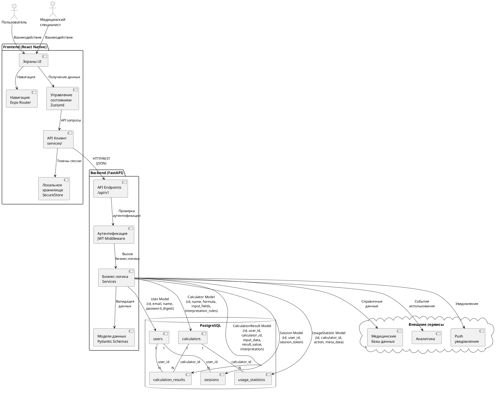
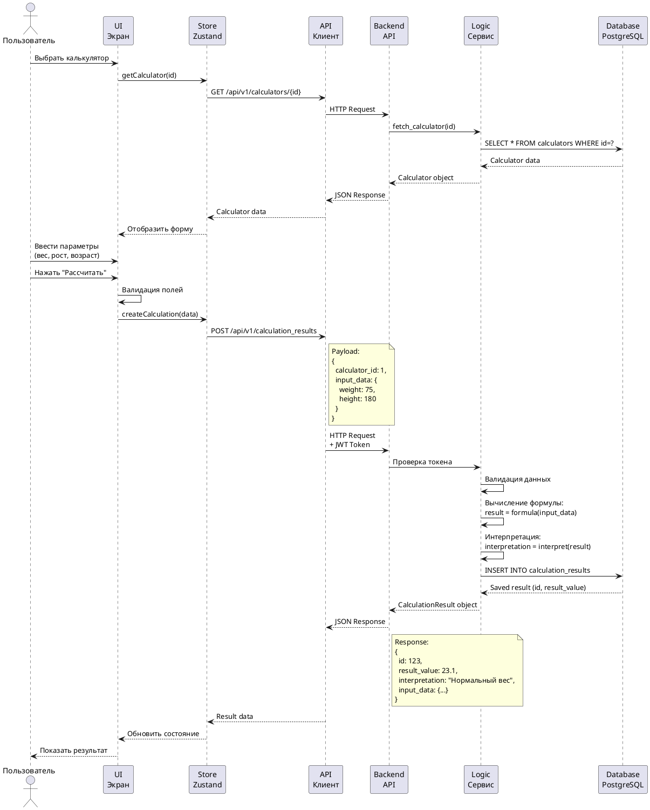
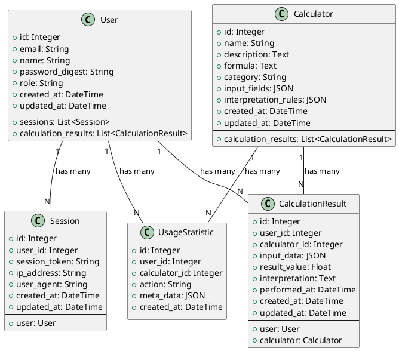
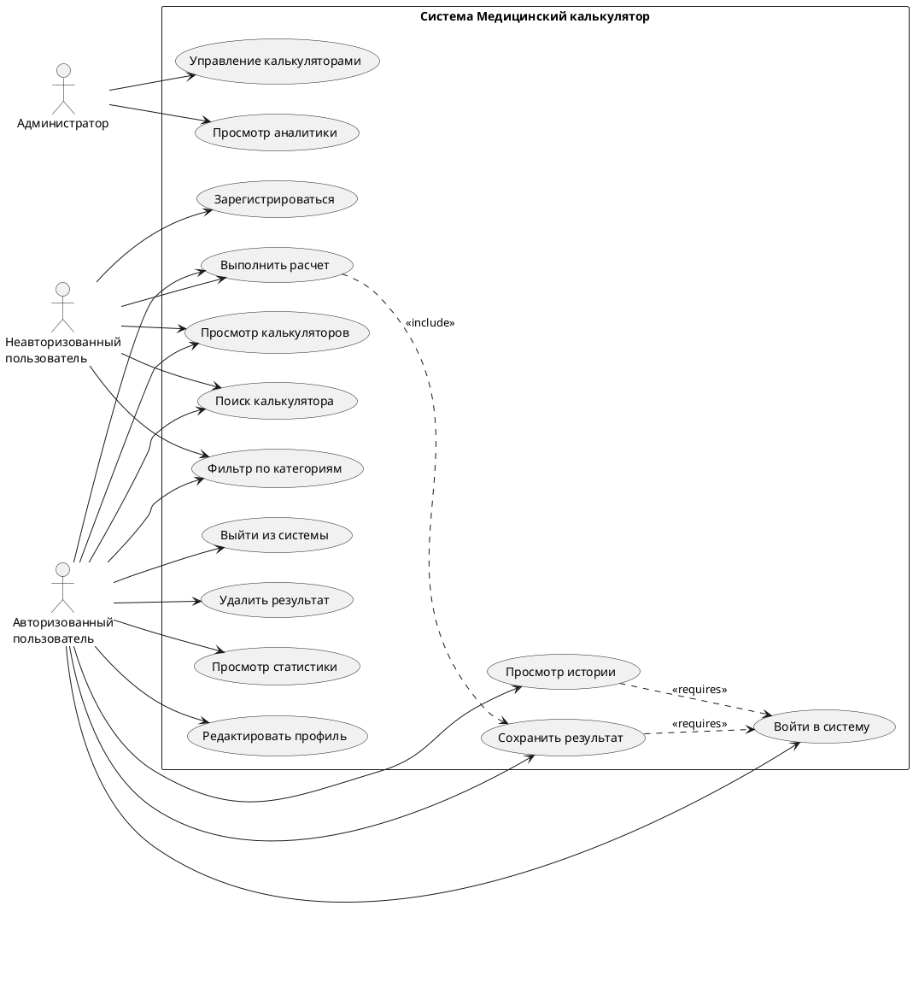
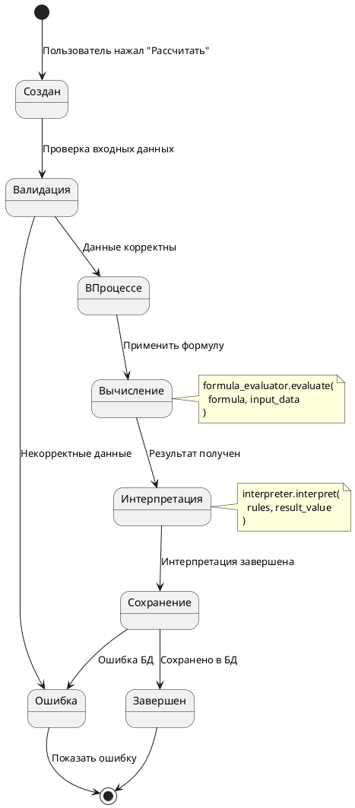
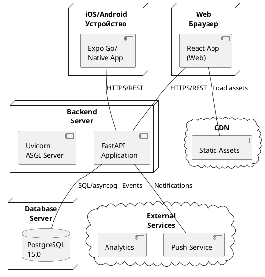

# UML-диаграмма архитектуры системы "Медицинский калькулятор"

## Архитектурная диаграмма

```
┌────────────────────────────────────────────────────────────────────┐
│                          МОБИЛЬНОЕ ПРИЛОЖЕНИЕ                       │
│                         (React Native + Expo)                       │
└────────────────────────────────────────────────────────────────────┘
                                    │
                                    │ HTTPS/REST API
                                    │ JSON
                                    ▼
┌────────────────────────────────────────────────────────────────────┐
│                         BACKEND API SERVER                          │
│                        (Python FastAPI)                             │
└────────────────────────────────────────────────────────────────────┘
                                    │
                                    │ SQL Queries
                                    │ SQLAlchemy ORM
                                    ▼
┌────────────────────────────────────────────────────────────────────┐
│                          DATABASE                                   │
│                        (PostgreSQL)                                 │
└────────────────────────────────────────────────────────────────────┘
```

## Диаграмма компонентов и взаимодействий



## Диаграмма последовательности: Выполнение расчета



## Диаграмма классов: Модели данных



## Диаграмма вариантов использования



## Диаграмма состояний: Жизненный цикл расчета



## Диаграмма развертывания



## Активные сущности системы

### 1. Пользователи
- **Неавторизованные пользователи**: могут просматривать калькуляторы и выполнять расчеты
- **Авторизованные пользователи**: полный доступ + история + статистика
- **Администраторы**: управление контентом и аналитика

### 2. Мобильное приложение (Frontend)
- Expo/React Native приложение
- Работает на iOS, Android, Web
- Управляет UI и локальным состоянием

### 3. API Сервер (Backend)
- Python FastAPI
- Обрабатывает REST API запросы
- Выполняет бизнес-логику

### 4. База данных
- PostgreSQL
- Хранит пользователей, калькуляторы, результаты
- Обеспечивает персистентность данных

### 5. Внешние сервисы
- Медицинские справочники (планируется)
- Аналитика (планируется)
- Push-уведомления (планируется)

## Модели данных для обмена

### UserModel
```typescript
{
  id: number
  email: string
  name?: string
  role: string
  created_at: datetime
}
```

### CalculatorModel
```typescript
{
  id: number
  name: string
  description?: string
  formula: string
  category: string
  input_fields: InputField[]
  interpretation_rules?: InterpretationRule[]
}
```

### CalculationResultModel
```typescript
{
  id: number
  user_id: number
  calculator_id: number
  input_data: Record<string, any>
  result_value: number
  interpretation?: string
  performed_at: datetime
}
```

### SessionModel
```typescript
{
  session_token: string
  user: UserModel
}
```

## Механизмы взаимодействия

1. **Аутентификация**: JWT токены в HTTP заголовках
2. **Авторизация**: Проверка токена middleware
3. **API запросы**: REST JSON через HTTPS
4. **Валидация**: Pydantic схемы на backend, форм-валидация на frontend
5. **Хранение**: SecureStore для токенов, PostgreSQL для данных
6. **Кэширование**: Zustand store на frontend
7. **Вычисления**: Mathjs для безопасной оценки формул

---

**Примечание:** Для рендеринга PlantUML диаграмм используйте:
- Online: http://www.plantuml.com/plantuml
- Local: VS Code PlantUML extension
- CLI: plantuml tool

Файлы .puml можно создать отдельно из блоков кода выше.
